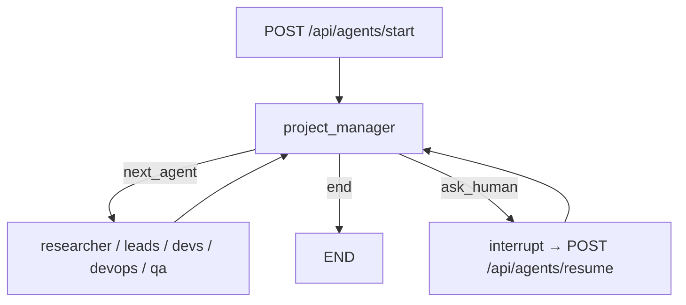
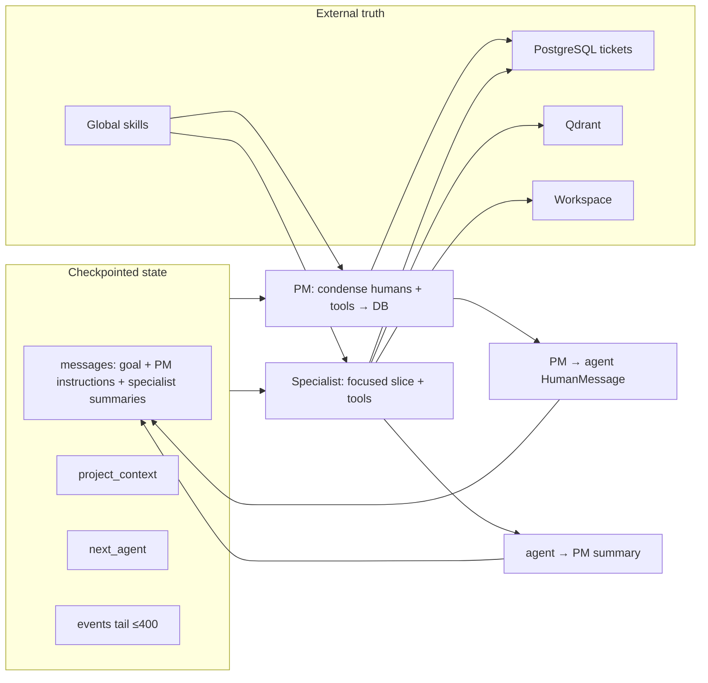

# Agent workflow and context

This document describes how the TDD Agentic orchestration graph carries context between steps, what each agent sees when it runs, and practical ways to reduce token use and checkpoint size.

## Overview

The stack is FastAPI plus a WebSocket UI, a LangGraph root graph with a project manager supervisor, specialist subgraphs, PostgreSQL for tickets and checkpoints, Qdrant for per-project RAG, and a per-project workspace on disk.

A **run** is one compiled graph per project. Every turn begins at the project manager, which sets `next_agent` and optionally appends a handoff message. The root graph dispatches one specialist (or ends). Each specialist completes one subgraph turn and returns control to the project manager.

Runs start via `POST /api/agents/start`, stream updates to the UI, persist LangGraph state in Postgres (`thread_id` equals `project_id`), and can resume from the latest checkpoint or a chosen historical checkpoint.

## Workflow

**Start payload.** The API seeds checkpointed `SystemState` with `project_id`, `project_context` (defaulting to the goal when empty), and an initial user message containing the goal. See `backend/api/routes/agents.py`.

**Human-in-the-loop.** The project manager can call `ask_human`, which triggers a LangGraph `interrupt`. The UI resumes with `POST /api/agents/resume`. Ticket-specific questions are stored in the database via `add_question_to_ticket` and answered through ticket APIs; the PM is instructed to treat the DB as ground truth, not chat memory.

**Deterministic PM side paths.** Before or alongside LLM routing, the supervisor can promote tickets from `IN_REVIEW` to `TODO`, infer the next dev route from pending subtasks, and fall back to DB-based routing when routing JSON is invalid or `end` is premature. See `backend/agents/project_manager/supervisor.py`.

**Specialist subgraphs.** Each specialist is built by `build_specialist_subgraph` in `backend/agents/runner.py`: a local tool loop with a per-role step cap, then a single summary handoff back to shared state.

## Where context lives

Context is not one blob. Four layers matter; only the first is fully replayed on every graph step.

| Layer | What it holds | Who reads it |
|-------|----------------|--------------|
| Checkpointed `SystemState` | Human handoffs, routing fields, a bounded event tail | Every graph node; serialized on each checkpoint |
| Per-invocation LLM window | System prompt, injected skills, condensed history, local tool loop | That node only; PM and specialist AI/tool turns are mostly not written back |
| External stores | Tickets, workspace files, Qdrant chunks, global skills registry | Via tools; intended source of truth for durable work |
| Observability | `agent_logs`, WebSocket events | UI replay and debugging; not the model’s working memory |

### Checkpointed state (`SystemState`)

Defined in `backend/agents/state.py`. Fields that actively shape prompts and routing:

- `messages` — appended via LangGraph `add_messages`; handoffs and instructions accumulate over the run.
- `project_id`, `project_context` — project identity and a short context string (capped when building prompts).
- `next_agent` — routing target consumed by `backend/agents/graph.py`.
- `events` — lightweight stream records; reducer keeps only the last 400 entries because full history lives in `agent_logs`.

Fields present on the model but **not wired** in application code today: `active_ticket_id`, `active_subtask_id`, `pending_questions`, `human_responses`. They add checkpoint schema surface without steering behavior unless implemented later.

The module docstring explicitly warns to keep checkpoint state small; large unbounded arrays can bloat Postgres and make resume fragile.

### External persistence

| Store | Role |
|-------|------|
| PostgreSQL tickets | Requirements, subtasks, RITE `test_cases`, todos, questions, statuses |
| Postgres checkpoints | Serialized `SystemState` per graph step |
| Qdrant | Chunked docs and skills per project |
| Workspace `workspace_root/<project_id>/` | Code, `docs/`, seeded `AGENTS.md` |
| Global `_skills/` | `registry.json` and `SKILL.md`; injected at prompt build time |
| `agent_logs` | Full event stream for UI replay |

Design intent: durable work lives in the **database, workspace, and RAG**. Chat holds routing, the original goal, and short summaries—not full tool transcripts.

## What each agent holds when it runs

Caps below are **characters**, not tokens (roughly 4:1 for English in `runner.py` and the PM supervisor).

### Project manager

**System prompt:** `PROJECT_MANAGER_SYSTEM` from `backend/agents/prompts.py`, plus role skills via `inject_skills`, `PROJECT_ID`, and `project_context` truncated to 1500 characters.

**Conversation input:** Up to eight human messages (first message kept, then a recent tail), each truncated to 2500 characters. Specialist AI and tool messages are dropped when building the PM prompt.

**Tools:** `list_tickets`, `get_ticket`, `create_ticket`, `update_ticket_status`, `add_question_to_ticket`, `rag_query`, `ask_human`.

**Per visit:** Up to eight tool-calling rounds; tool results truncated to 4000 characters in the local loop.

**Written back to checkpoint:** `next_agent`, optional `[from project_manager → <agent>]\n<instructions>`, and `events`. The PM does **not** persist its own intermediate AI or tool messages into shared `messages`.

**Routing output:** JSON with `next_agent`, `rationale`, and `instructions` (see prompts). Handoff instructions are expected to include real ticket UUIDs from tool results.

### Specialists (shared pattern)

All specialists use `build_specialist_subgraph` in `backend/agents/runner.py`.

**System prompt:** Role-specific base prompt from `backend/agents/prompts.py`, `inject_skills` for the role, `PROJECT_ID`, and `project_context` (≤1500 characters).

**Focused history** (`_build_specialist_input`), not full `state.messages`:

1. Original goal — first `HumanMessage`, relabeled `[original project goal]`, up to 4000 characters.
2. Latest PM instruction — `[from project_manager → <agent_name>]`, up to 12000 characters.
3. Cross-agent context — up to two recent `[from <agent> → project_manager]` summaries (2000 characters each) for most roles. **Omitted** for `backend_dev` and `frontend_dev`, which are steered to ticket tools and the current PM instruction only.

**Local tool loop:** Tool results truncated to 4000 characters per step; transcripts stay in the local `messages` list for that invocation only.

**Written back:** One `HumanMessage` summary `[from <name> → project_manager]\n...` (≤2000 characters) plus `events`.

**Step caps by role:**

| Role | `max_steps` |
|------|-------------|
| researcher | 14 |
| backend_lead, frontend_lead | 12 each |
| backend_dev, frontend_dev | 20 each |
| devops, qa | 18 each |

**Tools (high level):**

- **Researcher:** web search, RAG ingest/query, skill creation, filesystem tools.
- **Leads:** lead ticket tools plus `rag_query`; prompts include shared RITE and lead tool contracts.
- **Devs, DevOps, QA:** dev ticket tools, code/workspace tools, `rag_query`.

### Skills and RAG

**Skills:** `backend/agents/skills/loader.py` appends assigned `SKILL.md` bodies to the system prompt, up to 8000 characters total per invocation.

**RAG:** `rag_query` runs the CRAG pipeline in `backend/rag/retrieval.py` (retrieve, grade, optional rewrite and retry). Formatted context for the tool response is capped around 6000 characters. Grader LLM calls scale with retrieved chunk count (`k` defaults to 6).

## How context is carried between steps

**Handoff convention**

- PM → specialist: `[from project_manager → <agent>]\n<instructions>`
- Specialist → PM: `[from <agent> → project_manager]\n
`
- Original goal: first user message; specialists also see a relabeled copy in focused input.

**Resume behavior.** The PM system prompt requires `list_tickets(project_id)` at the start of every turn and decisions from current DB state, not from remembering prior chat turns. Checkpoints restore `SystemState`; tickets and workspace remain authoritative.

**Start duplication.** `project_context` is often set to the same string as the initial user message; specialists also prefix the goal again. That can repeat the same intent three times across fields in one specialist prompt.

## Efficiency and reducing context

### Already in the design

- PM and specialist **tool transcripts** stay in the local turn; only handoffs and summaries merge into checkpointed `messages`.
- PM reads **condensed human** history, not full specialist tool chains.
- Specialists read a **filtered slice** of `messages`, with stricter rules for product devs.
- **Character caps** on project context, handoffs, summaries, tool results, and PM human messages.
- **Ticket DB** as ground truth; RAG and workspace for docs and code.
- **Bounded** `events` tail in checkpoints; fuller history in `agent_logs`.

### Highest-impact improvements

1. **Checkpoint `messages` retention** — Condensation applies when **building** prompts, not when **persisting**. Long runs still grow Postgres checkpoints. Trim on write (e.g. keep last N handoffs), or store narrative handoffs only in `agent_logs` and keep routing metadata in graph state.
2. **Static prompt and skill weight** — Large PM and lead prompts, repeated RITE/lead blocks, and up to 8k of injected skills on every call. Prefer a short skill index in-prompt and full bodies via `rag_query` or one skill per turn; share one lead appendix instead of duplicating contracts.
3. **Goal deduplication** — Single canonical field: either `project_context` or the first human message, not both in specialist input.
4. **Ticket tool response shaping** — `get_ticket` can return full subtask trees and RITE cases. Offer a summary shape for PM/leads; reserve full payloads for dev paths that need active subtask detail.
5. **RAG defaults** — Lower `k`, cache graded chunks per query, skip rewrite when the first retrieval grades well.
6. **Dead `SystemState` fields** — Remove unused fields or wire `active_ticket_id` / `active_subtask_id` so routing does not rely on repeating UUIDs in prose handoffs.
7. **Structured PM handoffs** — Ticket ids and phase in structured fields instead of long natural-language repeats of DB content.
8. **Filesystem and shell tools** — Byte caps on reads; narrow default test scope to avoid huge outputs repeatedly hitting truncation.
9. **Events in checkpoints** — If the UI replays from `agent_logs`, shorten or omit the `events` tail in graph state.

### Operational knobs

- Per-role model slugs and rate limiting: `backend/agents/llm.py` and environment configuration.
- Graph `recursion_limit` (250) and transient-error retry from last checkpoint in `backend/api/routes/agents.py`.

## Key source files

| Path | Role |
|------|------|
| `backend/agents/graph.py` | Root graph; PM conditional routing; specialists return to PM |
| `backend/agents/state.py` | Shared checkpointed state |
| `backend/agents/runner.py` | Specialist factory; focused input; caps; summary handoff |
| `backend/agents/project_manager/supervisor.py` | PM node; condensation; routing; DB fallbacks |
| `backend/agents/prompts.py` | System prompts per role |
| `backend/agents/skills/loader.py` | Skill injection budget |
| `backend/api/routes/agents.py` | Start, resume, retry, stop |
| `backend/tools/ticket_tools.py` | Ticket tools for PM and agents |
| `backend/rag/retrieval.py` | CRAG retrieval and context formatting |
| `README.md` | Product-level architecture and lifecycle |
