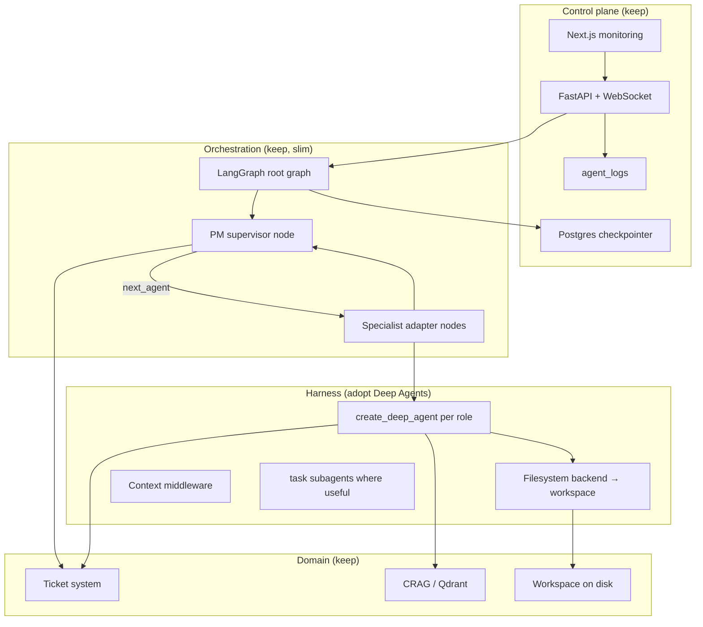

# Deep Agents integration review and implementation plan

This document reviews the current **tdd-agentic** orchestration stack, compares it to [LangChain Deep Agents](https://www.langchain.com/deep-agents), and proposes a phased plan to adopt Deep Agents where it reduces bespoke harness code while preserving TDD-first ticket workflows, the monitoring UI, and project-specific persistence.

**Audience:** engineers implementing the migration.  
**Companion doc:** [agent-context-and-workflow.md](./agent-context-and-workflow.md) (current context model).  
**Last updated:** 2026-05-11.

---

## Executive summary

**tdd-agentic** is a domain-specific multi-agent system: a Project Manager supervisor routes work across Researcher, Leads, Devs, DevOps, and QA agents using a custom LangGraph root graph, PostgreSQL tickets as ground truth, per-project workspace and RAG, and a Next.js monitoring client with HITL and checkpoint resume.

**Deep Agents** is a general-purpose agent harness on LangGraph that packages long-horizon concerns: planning (`write_todos`), virtual filesystem tools, subagent delegation (`task`), context compression and offloading, skills (progressive disclosure), memory (`AGENTS.md`), optional sandbox execution, and HITL via `interrupt_on`.

**Recommendation:** adopt Deep Agents **inside specialist roles and selected long-horizon paths**, not as a wholesale replacement of the PM-orchestrated TDD workflow. Keep the ticket system, API/WebSocket control plane, Postgres checkpointer, and PM routing graph as first-class custom layers. Replace or retire overlapping harness code (custom specialist tool loops, hand-rolled message trimming, duplicate filesystem tools, unused `langgraph-supervisor` dependency) incrementally.

**Do not** migrate the PM supervisor to `create_deep_agent` in phase 1. The PM’s value is deterministic ticket lifecycle side effects, JSON routing contracts, and DB fallbacks—not generic autonomous planning.

---

## Goals and non-goals

### Goals

- Reduce bespoke agent harness maintenance (context trimming, local tool loops, summary handoffs).
- Improve long-run stability via Deep Agents context middleware (compression, offload, subagent isolation).
- Align skills loading with the Agent Skills standard while keeping the existing skills registry and RAG path.
- Preserve TDD ticket/subtask/test-case semantics and Kanban UI as the source of truth for work state.
- Keep `thread_id = project_id`, checkpoint resume, and `agent_logs` observability for the monitoring client.

### Non-goals

- Replacing PostgreSQL tickets with Deep Agents `write_todos` as the work tracker.
- Dropping the FastAPI + WebSocket API in favor of LangSmith Fleet or `deepagents deploy` in early phases.
- Mandating remote sandboxes before local workspace parity is proven.
- Rewriting the frontend; adapt event shapes and resume flows only as needed.

---

## Current architecture (as-is)

### Control plane

| Component | Role |
|-----------|------|
| `POST /api/agents/start` | Seeds `SystemState`, spawns background graph run |
| `POST /api/agents/resume` | Resumes LangGraph after `interrupt()` (HITL) |
| `POST /api/agents/retry`, `/resume_from`, `/stop` | Checkpoint recovery and cancellation |
| WebSocket `/ws` + `agent_logs` | Live feed, bounded previews, checkpoint correlation |
| `AsyncPostgresSaver` | LangGraph checkpoints keyed by `project_id` |

### Orchestration graph

```
START → project_manager → (conditional) specialist → project_manager → … → END
```

- **PM node** (`backend/agents/project_manager/supervisor.py`): up to eight tool rounds; local AI/tool transcripts are not merged into shared `messages`; routing via `RoutingDecision` JSON; handoff `HumanMessage` with JSON header; DB fallbacks when JSON is invalid or `end` is premature; optional `ask_human` → `GraphInterrupt`.
- **Specialist subgraphs** (`backend/agents/runner.py`): single-node compiled subgraph per role; focused history slice; local tool loop with `max_steps`; one summary handoff back to PM; optional `active_subtask_id` from subtask tools.
- **State** (`backend/agents/state.py`): `messages` with `add_messages_trimmed`, `project_id`, `project_context`, `next_agent`, `active_ticket_id`, `active_subtask_id`; `events` reducer discards checkpointed events (UI uses bus + logs).

### Domain and tools

- **Tickets:** lifecycle state machine, subtasks, test cases, todos, questions (`backend/ticket_system/`).
- **RAG:** CRAG pipeline, per-project Qdrant collections (`backend/rag/`).
- **Code:** workspace-scoped `fs_*` and `run_tests` / shell tools (`backend/tools/code_tools.py`).
- **Skills:** role-index injection + `rag_query` for full `SKILL.md` (`backend/agents/skills/`).
- **HITL:** `ask_human` interrupt + ticket question APIs.

### Context management today

| Mechanism | Where | Limitation |
|-----------|--------|------------|
| Checkpoint message trim | `message_reducer.py` | Count cap only; dropped handoffs are not summarized structurally |
| PM condense | `supervisor._condense_messages_for_supervisor` | Read-time only; truncates humans to ~2500 chars |
| Specialist slice | `runner._build_specialist_input` | Rule-based; dev roles omit cross-handoffs |
| Char caps | runner, supervisor, config | Truncation without semantic retention |
| Ticket DB | PM + tools | Ground truth; PM must re-query each turn |
| `agent_logs` | Postgres | Audit/UI; not injected into prompts |

### Test and operational gaps

Orchestration tests cover helpers (routing JSON, handoff format, message reducer, one specialist-input case) but not compiled-graph flows, API lifecycle, interrupt/resume, or checkpointer round-trips. Any Deep Agents migration should add integration tests in those gaps.

### Dead or unused surface

- `langgraph-supervisor` in `pyproject.toml` is not imported.
- `litellm` is listed but not wired in agent code paths reviewed for this doc.
- `SystemState.pending_questions` / `human_responses` are legacy; HITL uses interrupts and ticket questions.

---

## Deep Agents (target harness capabilities)

Deep Agents (`deepagents` Python package; install separately from current `pyproject.toml`) provides:

| Capability | Harness feature | Relevance to tdd-agentic |
|------------|-----------------|---------------------------|
| Planning | `write_todos` persisted in agent state | Overlaps **ticket subtasks/todos**; use only as in-agent scratchpad or for PM-adjacent research, not as Kanban replacement |
| Filesystem | `ls`, `read_file`, `write_file`, `edit_file`, `glob`, `grep` on virtual FS | Overlaps **`code_tools.fs_*`**; map to per-project workspace backend |
| Subagents | `task` tool, ephemeral workers, compressed return | Overlaps **specialist subgraphs** for isolated multi-step work inside one role |
| Context | Compression, offload, subagent isolation | Addresses **long runs** and checkpoint/message growth |
| Skills | Progressive disclosure from `SKILL.md` dirs | Overlaps **skills loader + RAG**; can unify on Agent Skills layout |
| Memory | Always-on `AGENTS.md` | Overlaps **`project_context`** + optional structured session memory |
| HITL | `interrupt_on` per tool | Overlaps **`ask_human`** and future approval gates on `fs_write` / shell |
| Execution | `execute` with sandbox backends | Overlaps **subprocess tools**; optional phase 3+ |
| Deployment | LangSmith agent server, `deepagents deploy` | Optional later; keep self-hosted FastAPI initially |

Official guidance: use Deep Agents for **autonomous, complex, long-running** agents; use raw LangGraph for **low-level, stateful workflow control**. tdd-agentic is explicitly the latter at the **root** and the former at **specialist leaves**.

References:

- [Harness capabilities](https://docs.langchain.com/oss/python/deepagents/harness)
- [Context engineering](https://docs.langchain.com/oss/python/deepagents/context-engineering)
- [Backends](https://docs.langchain.com/oss/python/deepagents/backends)
- [Skills](https://docs.langchain.com/oss/python/deepagents/skills)

---

## Fit analysis: replace, wrap, or keep

### Keep (domain-specific, do not replace with Deep Agents)

| Area | Rationale |
|------|-----------|
| Ticket system + Kanban API | Legal workflow, RITE/test cases, status machine, human questions on tickets |
| PM supervisor graph node | Deterministic promotions, dev-route inference, routing JSON + fallbacks |
| Root `StateGraph` wiring | Explicit `next_agent` dispatch matches product roles |
| Postgres checkpointer + `thread_id = project_id` | Resume, branch, crash recovery already integrated in UI |
| FastAPI routes, WebSocket, `agent_logs` | Monitoring client contract |
| CRAG RAG pipeline | Project-scoped retrieval with grading; expose as custom tools |
| Ticket tools (`create_ticket`, `get_ticket`, subtask tools) | Core product API for agents |
| Langfuse hooks (optional) | Already pluggable in graph runs |

### Replace or retire (overlapping harness)

| Current | Deep Agents / alternative | Notes |
|---------|---------------------------|--------|
| `build_specialist_subgraph` local tool loop | `create_deep_agent` per role behind a thin adapter node | Preserve one summary + state update outward to PM |
| `code_tools.fs_*` (for migrated roles) | Filesystem backend rooted at `workspace_root/<project_id>` | Retain path sandbox via backend permissions |
| Hand-rolled truncation-only context | Harness compression + optional structured `session_memory` on `SystemState` | Do not rely on LLM compaction on every checkpoint write |
| `inject_skills` index-only | Deep Agents `skills=` paths + keep `rag_query` for Hub-scale content | Migrate `workspace_root/_skills` layout to Agent Skills dirs |
| `langgraph-supervisor` dependency | Remove | Unused |
| Duplicate goal in `project_context` + first human + specialist prefix | Single canonical field + memory file | Dedupe during migration |

### Wrap (use Deep Agents inside existing graph)

| Pattern | Description |
|---------|-------------|
| **Specialist-as-deep-agent** | Each specialist node invokes a compiled deep agent with role system prompt, role tools, and `subagents` only where parallel isolation helps (e.g. QA test matrix, researcher sources). |
| **PM unchanged** | PM continues to use LangChain tool loop + `RoutingDecision`; passes `instructions` + `ticket_ids` in handoff JSON. |
| **Checkpoint boundary** | Deep agent internal message state stays inside the specialist invocation; graph checkpoint still stores PM handoffs, routing fields, and a compact `session_memory` / summary. |

### Defer or optional

| Item | When |
|------|------|
| Remote sandbox backends | When local workspace + `execute` isolation is required for untrusted code |
| `deepagents deploy` / Fleet | When multi-tenant hosted agents are a product requirement |
| PM as deep agent | Only if PM tool surface shrinks to routing + tickets without custom fallbacks |
| `write_todos` as user-visible plan | Never as substitute for tickets; optional dev scratchpad only |

---

## Proposed target architecture

### Layered model



### State model after migration

**Root `SystemState` (checkpointed, bounded)**

- `messages` — handoffs only; trim on merge (existing reducer); optionally shrink further once `session_memory` exists.
- `session_memory` (new) — structured rolling record: goal, `last_route`, `active_ticket_id`, `active_subtask_id`, capped `recent_handoffs`, blockers, human decisions; updated on PM route and specialist return; fold evicted messages deterministically.
- `project_id`, `project_context`, `next_agent`, `active_*` — unchanged semantics; wire `active_*` consistently on PM and specialist returns.
- No checkpointed full deep-agent transcripts.

**Per-invocation (not checkpointed)**

- Deep agent thread state for the current specialist turn (managed by Deep Agents middleware).
- Tool transcripts until summarized into the single PM handoff.

**External (source of truth)**

- Tickets/subtasks/todos/test cases.
- Workspace files.
- Qdrant chunks.
- `agent_logs` for full audit.

### Specialist adapter contract

Each `build_*_subgraph` becomes:

1. Build runtime context: `project_id`, `active_ticket_id`, `active_subtask_id`, PM handoff body, optional `session_memory` excerpt.
2. Invoke role deep agent with bound tools and filesystem backend scoped to project workspace.
3. On completion: emit `turn_end` / tool events to bus; append one `[from <role> → project_manager]` message; merge `session_memory` and `active_subtask_id` if detected.
4. On `GraphInterrupt` / `interrupt_on`: propagate to root graph unchanged.

### Tool surface per role

| Role | Deep agent tools | Custom tools (retain) |
|------|------------------|------------------------|
| PM | N/A (not deep agent in phase 1–2) | All `PM_TICKET_TOOLS`, `rag_query`, `ask_human` |
| Researcher | FS, optional `task` subagents | `web_search_*`, `rag_ingest_text`, `rag_query`, skill-creation tools |
| Leads | FS, `write_todos` (scratchpad only) | Ticket lead tools, `rag_query` |
| Devs | FS, `edit_file`, optional `execute` (later) | `next_pending_subtask*`, test run tools, ticket dev tools |
| DevOps / QA | FS, `task` for parallel checks | Ticket tools, test runners |

Ticket tools remain LangChain `@tool` functions; Deep Agents accepts additional tools on `create_deep_agent(tools=[...])`.

### Filesystem mapping

Use a **FilesystemBackend** (or custom backend implementing the harness protocol) with:

- Root: `settings.workspace_root / project_id`
- **Permissions:** deny reads outside project root; deny `.env` and credential globs; align with `_resolve` rules in `code_tools.py`.
- Deprecate `fs_*` for roles that use the harness; keep thin wrappers during transition if dual-write is needed.

### Skills and memory

- **Skills:** point Deep Agents `skills=` at `workspace_root/_skills/<skill_name>/` with standard `SKILL.md` frontmatter; keep registry for role assignment, migrate descriptions into frontmatter.
- **Memory:** project-level `AGENTS.md` under workspace (TDD conventions, stack choices); load via Deep Agents `memory=`; sync summary into `project_context` on project create only.
- **RAG:** keep `rag_query` for large doc corpora; skills for procedural workflows.

### HITL

- **Graph-level:** `ask_human` remains on PM (and optionally on specialists) via LangGraph `interrupt()`.
- **Tool-level:** `interrupt_on={"fs_write": True, "execute": True}` for destructive ops when product requires approval cards per tool call; map harness interrupts to the same WebSocket `interrupt` event shape the UI expects.

---

## Phased implementation plan

### Phase 0 — Foundation (1–2 weeks)

**Objectives:** dependency baseline, design spikes, no user-visible behavior change.

- Add `deepagents` (and version pin) to `pyproject.toml`; document Python/LangGraph compatibility with existing pins.
- Remove unused `langgraph-supervisor` from dependencies.
- Spike: `create_deep_agent` with `FilesystemBackend` on a temp workspace; verify `interrupt`, checkpoint serde with `AsyncPostgresSaver` when deep agent is a **subgraph node**.
- Define `session_memory` schema and `merge_session_memory` reducer (see [agent-context-and-workflow.md](./agent-context-and-workflow.md) recommendations); unit tests only.
- Add integration test harness: mock LLM, compile `build_root_graph`, one PM → specialist → PM cycle.

**Exit criteria:** CI green; spike doc in PR; decision on deep-agent package version.

### Phase 1 — Researcher pilot (2–3 weeks)

**Objectives:** first production role on Deep Agents; learn adapter pattern.

- Implement `backend/agents/deep/adapter.py`: `run_deep_specialist(role, state, tools, system_prompt) -> SpecialistResult`.
- Replace `researcher` subgraph internals with deep agent; keep external node name and return shape.
- Map workspace FS to harness; keep `web_search` and RAG tools as custom tools.
- Wire `emit` for tool results (preview caps unchanged).
- Compare token usage and step counts vs baseline on 3–5 fixed scenarios.

**Exit criteria:** Researcher E2E through UI; no regression on resume/retry; rollback flag `USE_DEEP_AGENT_RESEARCHER=false`.

### Phase 2 — Dev and lead roles (3–4 weeks)

**Objectives:** roles with highest tool churn benefit from compression.

- Migrate `backend_dev`, `frontend_dev` (omit cross-handoff context in deep agent input; rely on subtask tools + PM handoff).
- Migrate leads with ticket decomposition tools; restrict `write_todos` to non-persisted planning or disable if it confuses ticket model.
- Introduce `session_memory` on `SystemState`; fold on message eviction in `add_messages_trimmed`; inject capped block into PM system prompt.
- Deprecate `code_tools.fs_*` for migrated roles; single FS implementation.
- Optional: `interrupt_on` for `write_file`/`edit_file` behind env flag.

**Exit criteria:** Long-run soak test (50+ graph steps) without checkpoint bloat regression; specialist summaries still one message per turn.

### Phase 3 — QA, DevOps, context hardening (2–3 weeks)

**Objectives:** parallel subtasks and operational safety.

- QA/DevOps: enable `task` subagents for parallel test/lint shards with merged summary to PM.
- Evaluate sandbox `execute` vs existing shell tool; if adopted, route DevOps only first.
- PM prompt: structured handoff only; reduce prose duplication of ticket payloads (`get_ticket` summary shape for PM).
- Frontend: only if new interrupt kinds appear; otherwise unchanged.

**Exit criteria:** Documented tool matrix per role; security review for FS permissions and shell.

### Phase 4 — Consolidation and cleanup (1–2 weeks)

**Objectives:** remove dead code paths.

- Delete legacy `build_specialist_subgraph` loop if all roles migrated.
- Remove duplicate FS tools and unused state fields or wire `active_*` fully.
- Align skills tree with Agent Skills standard; update researcher skill-creation path.
- Expand integration tests: interrupt/resume, `resume_from`, transient LLM retry.

**Optional Phase 5 — Deployment**

- Evaluate LangSmith agent server vs current FastAPI only for **hosted** deployments; not required for self-hosted Docker Compose.

---

## Work breakdown (engineering tasks)

| ID | Task | Depends |
|----|------|---------|
| D0-1 | Pin `deepagents`, compatibility matrix | — |
| D0-2 | `session_memory` module + reducer + tests | — |
| D0-3 | Graph integration test fixture | — |
| D1-1 | `deep/adapter.py` + runtime context | D0-1 |
| D1-2 | Researcher subgraph swap | D1-1 |
| D1-3 | FS backend + permissions | D1-1 |
| D1-4 | Observability parity (`emit`, Langfuse) | D1-2 |
| D2-1 | Dev/lead migration | D1-2 |
| D2-2 | Message eviction → memory fold | D0-2 |
| D2-3 | Retire `fs_*` for migrated roles | D2-1, D1-3 |
| D3-1 | QA/DevOps + subagents | D2-1 |
| D3-2 | `interrupt_on` mapping to UI | D2-1 |
| D4-1 | Remove legacy runner loop | D3-1 |
| D4-2 | Docs + README architecture diagram | D4-1 |

---

## Risks and mitigations

| Risk | Impact | Mitigation |
|------|--------|------------|
| Double source of truth (todos vs tickets) | Wrong Kanban state | Disable or namespace harness `write_todos`; document “tickets only” in system prompts |
| Checkpoint serde breaks on deep state | Resume failures | Keep deep state inside node; serde allowlist in `checkpointer.py`; round-trip tests |
| Interrupt shape mismatch | UI stuck | Adapter normalizes harness interrupts to existing `ask_human` payload contract |
| Token cost increase from subagents | Higher spend | Use `task` only for parallelizable work; cap subagent depth in profile |
| Loss of deterministic PM fallbacks | Stuck runs | Do not migrate PM until parity proven; keep `_infer_fallback_route` |
| Vendor coupling | Upgrade churn | Pin versions; adapter isolates `create_deep_agent` API |
| Regression in TDD enforcement | Untested code merged | QA/Dev tools must still require test-case tools; no change to ticket schema gates |

---

## Success metrics

- **Checkpoint size:** p95 `pg_column_size(checkpoint)` stable or decreasing on 100-step synthetic run after `session_memory` + trim.
- **Resume reliability:** 100% success on retry/resume_from tests across migrated roles.
- **Context tokens:** specialist input tokens ↓ vs baseline on fixed scenarios (measure via Langfuse or logged usage).
- **Harness LOC:** net reduction in `runner.py` and `code_tools.py` after phase 4.
- **Product invariants:** ticket lifecycle tests green; UI HITL and checkpoint panels unchanged for core flows.

---

## Open decisions (resolve before Phase 1)

1. **Minimum Deep Agents version** and LangGraph pin alignment.
2. **Whether dev roles get `execute` locally** or keep subprocess tool until sandbox lands.
3. **`write_todos`:** off, renamed scratchpad, or PM-only.
4. **Structured `session_memory` vs Deep Agents long-term memory files** — likely both: memory for conventions, session_memory for run narrative.
5. **Feature flags per role** vs big-bang migration.

---

## Appendix A — File touch map

| Path | Phase | Action |
|------|-------|--------|
| `pyproject.toml` | 0 | Add `deepagents`, drop `langgraph-supervisor` |
| `backend/agents/deep/` | 1 | New: adapter, backend factory, profiles |
| `backend/agents/runner.py` | 1–4 | Shrink to adapter delegation |
| `backend/agents/researcher/subgraph.py` | 1 | Wire deep agent |
| `backend/agents/developers/*`, `leads/*` | 2–3 | Wire deep agent |
| `backend/agents/state.py` | 2 | `session_memory` field |
| `backend/agents/message_reducer.py` | 2 | Eviction fold |
| `backend/agents/project_manager/supervisor.py` | 2 | Inject session memory; keep routing |
| `backend/tools/code_tools.py` | 2–4 | Deprecate overlap |
| `backend/agents/skills/` | 4 | Align with Agent Skills layout |
| `backend/agents/checkpointer.py` | 1 | Serde tests for new state |
| `backend/tests/` | 0–4 | Integration + adapter tests |
| `docs/agent-context-and-workflow.md` | 4 | Cross-link and update context table |

## Appendix B — What not to migrate

- Ticket ORM, service, and REST routes.
- Root graph topology and PM conditional edges.
- Qdrant ingestion and CRAG grading logic (only tool wrappers).
- Frontend Zustand store and checkpoint list cache behavior.
- `thread_id = project_id` identity model.

---

## Summary

Deep Agents is a strong fit for **specialist harness and long-horizon context**, not for replacing the **TDD ticket orchestration** that defines tdd-agentic. The recommended path is a **hybrid**: LangGraph root + PM supervisor + Postgres checkpoints and monitoring APIs stay; specialist nodes become Deep Agent adapters backed by the project workspace and ticket/RAG tools; structured **session memory** covers what message trimming drops. Execute in phased pilots starting with Researcher, measure checkpoint and token metrics, and retire duplicate filesystem and tool-loop code once parity is proven.
